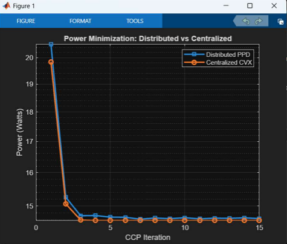
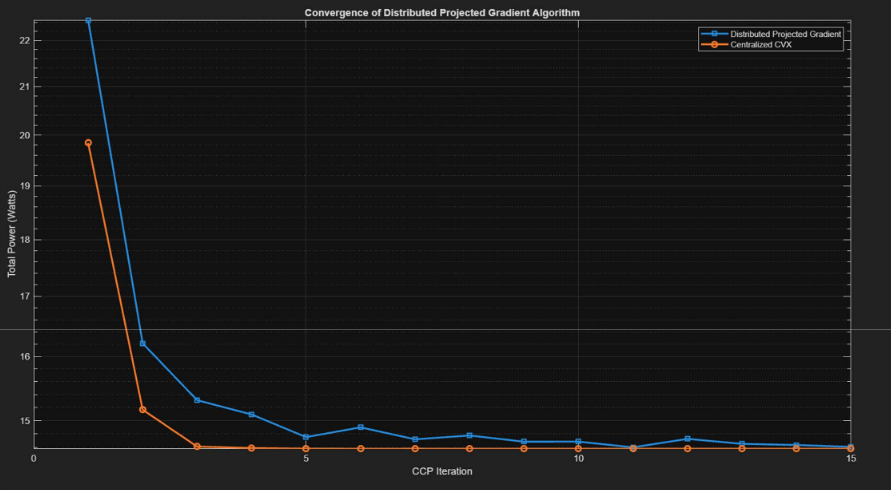
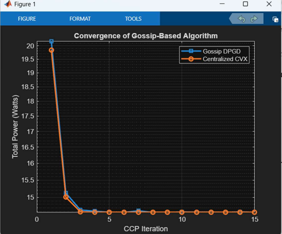
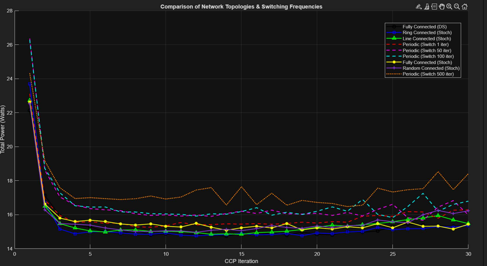

# Distributed Beamforming Optimization

This repository contains a project for the **Distributed Optimization and Learning (DOL)** course.

The project studies distributed algorithms for power minimization in a multi-antenna beamforming problem. The goal is to design beamforming vectors that satisfy SINR constraints for all users while keeping the total transmit power small and respecting per-antenna power limits.

## Problem

We consider a transmitter with several antennas and several beams. Each user is served by one beam.

The beamforming problem is:

$$
\min_W \|W\|_F^2
$$

subject to SINR constraints

$$
\frac{|h_k^H w_k|^2}{\sigma^2 + \sum_{j \neq k} |h_k^H w_j|^2}
\geq \gamma_k,
$$

and per-antenna power constraints

$$
\sum_m |w_{n,m}|^2 \leq P_n.
$$

This problem is non-convex because the SINR constraints contain coupled quadratic terms. I used CCP/SCA to linearize the SINR constraints, and then solved the resulting subproblems using distributed optimization methods.

## What I Implemented

| File | Description |
|---|---|
| `PPD.m` | Distributed Penalty Primal-Dual method for the CCP beamforming subproblem |
| `DPGD.m` | Distributed Projected Gradient Descent baseline |
| `Gossip.m` | Asynchronous gossip-based distributed projected gradient method |
| `Compare_Penalty.m` | Comparison of graph topologies and switching frequencies |
| `Noisy_Links.m` | Noisy-link experiment with damping |
| `Report.pdf` | Original course report |

## Method

The main structure is:

1. Start from the non-convex beamforming problem.
2. Use **CCP/SCA** to convexify the SINR constraints around the previous beamformer.
3. Solve each CCP subproblem using distributed methods.
4. Compare the distributed result with a centralized CVX benchmark.
5. Check convergence, total power, and constraint satisfaction.

### Distributed Penalty Primal-Dual

Each antenna is treated as a node. Node \(n\) controls the \(n\)-th row of the beamforming matrix \(W\), but keeps a local estimate of the full matrix and dual variables.

Each iteration has three main parts:

- consensus with neighboring nodes,
- primal descent on the penalty Lagrangian,
- dual ascent for violated SINR and power constraints.

The penalty Lagrangian is based on total power plus penalties for constraint violations:

$$
H(W,\mu)
=
\|W\|_F^2
+
N\sum_k \mu_k [g_k^{SINR}(W)]_+
+
N\sum_n \mu_{K+n} [g_n^{POW}(W)]_+.
$$

### Distributed Projected Gradient Descent

I also implemented a simpler distributed projected-gradient method. After each gradient step, every antenna row is projected back onto its power constraint:

$$
w_n \leftarrow w_n \frac{\sqrt{P_n}}{\|w_n\|}
\quad
\text{if}
\quad
\|w_n\|^2 > P_n.
$$

### Gossip-Based Update

In the gossip version, only two randomly selected nodes communicate at each inner iteration. They average their local beamforming matrices, update them, and project back to the feasible power set.

This makes the method closer to an asynchronous communication network.

## Experiment Setup

| Parameter | Value |
|---|---:|
| Antennas | 4 |
| Beams | 3 |
| Users | 3 |
| Noise power | 1 |
| SINR target | 10 |
| Per-antenna power limit | 10 W |
| Benchmark | Centralized CVX |

## Results

### Distributed PPD vs Centralized CVX

<p align="center">
  
</p>

**Figure 1.** Distributed PPD compared with centralized CVX. The distributed method quickly approaches the centralized benchmark after a few CCP iterations.

### Distributed Projected Gradient Descent

<p align="center">
  
</p>

**Figure 2.** Distributed Projected Gradient Descent compared with centralized CVX. The method converges close to the centralized solution, with a small amount of oscillation.

### Gossip-Based Distributed Method

<p align="center">
  
</p>

**Figure 3.** Gossip-based distributed projected gradient method. Even with pairwise asynchronous communication, the method reaches a solution close to the centralized benchmark.

### Network Topology Comparison

<p align="center">
  
</p>

**Figure 4.** Comparison of different communication topologies and switching frequencies. Fully connected and ring-like graphs behave more stably, while slow periodic switching causes larger misadjustment.

## What the Results Show

The experiments show that distributed methods can get close to the centralized CVX solution for this beamforming setup.

The PPD method gives the closest match to CVX. DPGD is simpler but slightly less smooth. The gossip method is more communication-efficient because only two nodes communicate at each step, but it still converges well. The topology experiment shows that the communication graph matters: slow switching or weaker connectivity can increase oscillations and final power.

## Tools Used

- MATLAB
- CVX for centralized benchmark comparison
- CCP/SCA for SINR constraint linearization
- Distributed Penalty Primal-Dual optimization
- Distributed Projected Gradient Descent
- Asynchronous gossip updates
- Network topology comparison

## Repository Structure

```text
distributed-beamforming-optimization/
├── README.md
├── PPD.m
├── DPGD.m
├── Gossip.m
├── Noisy_Links.m
├── Compare_Penalty.m
├── Report.pdf
└── figures/
    ├── distributed_vs_centralized_ppd.png
    ├── dpgd_vs_cvx_convergence.png
    ├── gossip_vs_cvx_convergence.png
    └── topology_switching_comparison.png
```

## How to Run

Open MATLAB in the repository folder and run:

```matlab
PPD
DPGD
Gossip
Compare_Penalty
Noisy_Links
```

CVX is needed for the centralized benchmark curves.

## Key Takeaways

- CCP/SCA turns the non-convex SINR constraints into local convex approximations.
- Distributed PPD closely follows the centralized CVX benchmark.
- DPGD is simpler but needs careful penalty and step-size tuning.
- Gossip communication works even when only random pairs of nodes communicate.
- The communication topology has a clear effect on convergence and final power.

## License

MIT